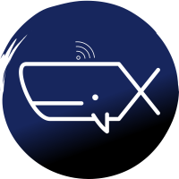
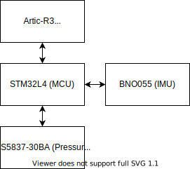

# Tracka

**WARNING!**: This repository is under construction, please expect breaking
changes to all APIs.

Tracka is an open source wildlife satellite tag that connects to the Argos network.
This tag is being developed in the open because we want to fully maximize the
impact that this tag will have economically, socially and environmentally.

# Wildlife-blue

The primary goal for the wildlife-blue collective of projects is to
fundamentally shift our current way of thinking about how we interact with our
environment. Very often it is tempting to think about the environment as
'something else' almost as if we are in competition with it. We build houses,
roads, cars all to escape and control the natural world. Don't get me wrong,
living in a house is pretty great. **But**, we as a species integrate with our
environment in pretty destructive ways. This hurts the natural ecosystem but
also us as individuals. Unless you live under a rock you've probably at least
heard of problems such as deforestation, climate change and ocean plastic. Very
often in the discourse around these issues, the arguments are reduced down to
conflicts between economics and environmental sustainability. The goal of
wildlife-blue is demonstrate that there is another narrative. By shifting our
diverging relationship with nature to one, slowly converging we can
create a healthier, more productive and more economically prosperous society.

## Getting started

There a are a few different technical area's that make up the design for a
Whale tag;

- Biological knowhow, (Open)
- Mechanical design, (Open pending choice of version control)
- Antenna design (In progress)
- Electronics design, (Open pending shift from Altium Designer to Circuitmaker)
- Software design, (Open)
- Manufacturing and supply chain. (Open, when we have a supply chain 😉)

All aspects of the hardware design will eventually be open sourced. However,
we are trying to find the best way to manage these. How we go about designing
the hardware itself comes down to a number of factors;

- The CAD and ECAD suites that we use,
- How easy they are to use,
- The accessibility of the chosen CAD suites that we use
  (some of these require extremely expensive subscriptions),
- The method of distributing and collaborating on the hardware design.
  In some cases git doesn't end up being the best version control system for
  CAD binaries.

### Software

The majority of our software is written in C++ and targets embedded
microcontrollers. Currently only Linux is officially supported, Macos will
likely work in most cases, and Windows support is more limited but you might
be successful developing from WSL.

**Depdencies**:

- Bazel Build: Please see the Bazel documentation for [installing on your respective
  system](https://docs.bazel.build/versions/master/install.html).
- Libncurses (Linux/WSL only): `sudo apt install libncurses5`

All other dependencies will be pulled down by the Bazel build system.

## System overview

The first iteration of the wildlife tracking tag integrates two sensors;

- A 9-axis inertial measurement unit (IMU),
- A pressure and temperature sensor with a 2mm depth resolution capable of
  measurement up to 300m and survivability up to 500m.

The logic is all tied together with an ultra-low power ARM Cortex-M4. Location
determination is handled by the Artic-R3 ASIC radio developed to communicate on
the satellite Argos network. The Argos network offers both localization and
data transfer.

An overview of this is shown below.

